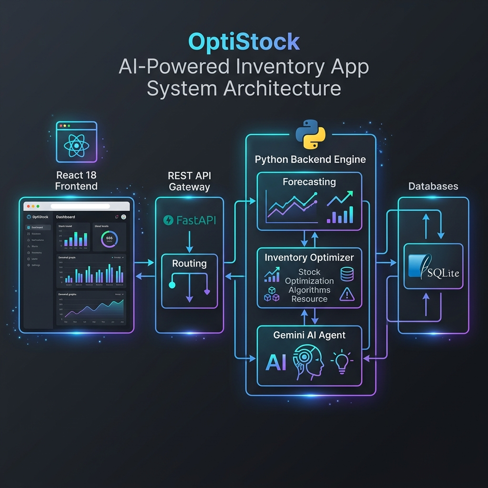
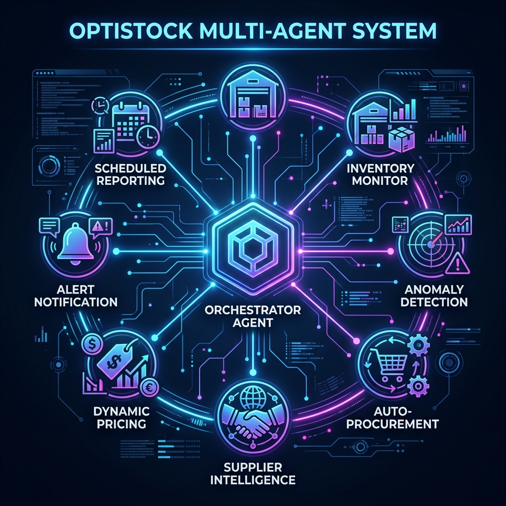

# OptiStock AI: Autonomous Multi-Agent Inventory Intelligence & Demand Forecasting System

OptiStock is a production-grade, AI-powered inventory intelligence and decision system designed specifically for **MSME (Micro, Small, and Medium Enterprises)** owners. The system provides plain-language, actionable business intelligence and demand forecasting, eliminating technical and mathematical complexity for shop managers.

---

## 🏗️ System Architecture

The application is structured as a decoupled React frontend and FastAPI backend communicating via a REST API:



### 🏢 Platform Components

1. **Presentation Layer (Frontend):**
   * Built with **React 18** as a single-page dashboard.
   * Utilizes **Recharts** for interactive visual analytics, and **Lucide React** for modern iconography.
   * Leverages custom responsive CSS modules for seamless shop-floor mobile/desktop usage.

2. **Application Layer (Backend API):**
   * Built using **FastAPI** (Python) for high-concurrency routing.
   * **AI Orchestration (`agent_logic.py`):** Integrates with Google Gemini to generate human-readable business advice.
   * **Forecasting Engine (`advanced_forecasting.py`):** Combines XGBoost with statistical models (ExponentialSmoothing) to predict stock demand.
   * **Optimization Engine (`inventory_optimizer.py`):** Computes statistical Safety Stock, Reorder Point (ROP), and Economic Order Quantities (EOQ) using standard deviations and Z-scores.

3. **Data Layer:**
   * Uses **SQLite** for relational database storage and offline persistence.

---

## 🐙 Multi-Agent System Architecture

At the core of the backend is an autonomous multi-agent system coordinated by a centralized Orchestrator:



### 👥 Specialized Sub-Agent Roles

All agents inherit from the core `BaseAgent` class and communicate asynchronously through the `OrchestratorAgent`:

1. **Inventory Monitor Agent:** Analyzes stock levels, checks daily sales velocity, and flags critical stockouts or overstock warnings.
2. **Anomaly Detection Agent:** Reviews historical sales trends to discover anomalous drops or spikes in consumer demand.
3. **Auto-Procurement Agent:** Automatically calculates safety margins, replenishment timelines, and drafts purchase orders.
4. **Supplier Intelligence Agent:** Assesses supplier scores (A to F grade) based on delivery speeds, lead times, defect rates, and costs.
5. **Dynamic Pricing Agent:** Computes price adjustments based on stock age, decay risk, and consumer demand velocity.
6. **Alert Notification Agent:** Packages critical notifications and logs system alerts for store managers.
7. **Scheduled Reporting Agent:** Generates executive daily summaries and email briefs automatically.

---

## ✨ Features

* **Google Gemini AI Integration:** Translates complex statistics (like standard deviations and standard errors) into clear business recommendations (e.g., *"You will run out of stock in 5 days, order by Wednesday"*).
* **Natural Language Query Engine:** Allows users to query their database in conversational English (e.g., *"Show me all critical risk items"*).
* **Advanced Hybrid ML Forecasting:** Combines machine learning (XGBoost) and statistical seasonality modeling (Statsmodels) for highly accurate 30-day demand predictions.
* **Offline-Ready Fallbacks:** Runs seamlessly offline or without a Gemini API key using mathematical heuristics and rule-based NLP matchers.
* **Supplier Performance Scoring:** Automatically grades suppliers to help shop owners source goods reliably.

---

## 🔧 Technical Stack

| Layer | Technology | Purpose |
|-------|------------|---------|
| **Frontend** | React 18.2 | Interactive SPA user interface |
| **State** | React Hooks | Session state management |
| **Charts** | Recharts | Data visualization |
| **Backend** | FastAPI | REST API Server |
| **AI Integration** | Google Gemini | Conversational insights & NLP queries |
| **Database** | SQLite / Firestore | Relational offline storage |
| **Machine Learning** | XGBoost & Scikit-learn | Predictive demand forecasting |
| **Statistical Analysis** | SciPy & Statsmodels | Safety stock & safety margin calculations |

---

## 🚀 Getting Started

### Prerequisites
* Python 3.10+
* Node.js 18+

### 1. Backend Setup
1. Navigate to the main directory:
   ```bash
   cd optistock
   ```
2. Install dependencies:
   ```bash
   pip install -r requirements.txt
   ```
3. Set your environment variables in `.env` (copy from `src/.env.example`):
   ```bash
   GEMINI_API_KEY="your-gemini-api-key"
   ```
4. Start the FastAPI development server:
   ```bash
   python -m uvicorn src.api:app --reload --port 8000
   ```

### 2. Frontend Setup
1. Navigate to the frontend directory:
   ```bash
   cd optistock/frontend
   ```
2. Install npm packages:
   ```bash
   npm install
   ```
3. Run the development server:
   ```bash
   npm start
   ```
   The React dashboard will be accessible at **http://localhost:3000**.
