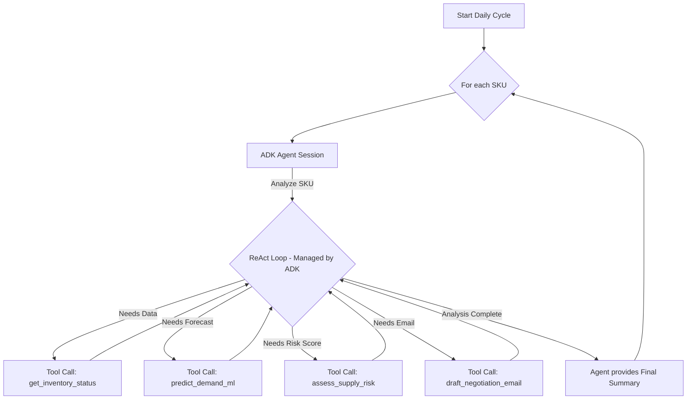

# 🤖 OptiStock: Autonomous Procurement Agent (ADK Edition)

**Team:** GDG-219 AURAx
**Event:** Agentathon 2025 (GDG Hyderabad)

OptiStock is a production-grade, autonomous procurement agent designed for MSMEs. This version is built using the official **Google Agent Development Kit (ADK)** to demonstrate a robust, tool-augmented architecture powered by Vertex AI's Gemini 1.5 Pro.

---

## 📁 Project Structure

```
.
├── src/                    # Python source code.
│   └── app.py              # Main Streamlit UI and agent orchestration logic.
├── data/                   # Data files.
│   └── supply_chain_data.csv   # Mock database for inventory and sales history.
├── Dockerfile              # Defines the Docker image for the application.
├── requirements.txt        # Python dependencies.
└── README.md               # Project documentation.
```

---

## 🏛️ Architecture: A Neuro-Symbolic Hybrid with ADK

The agent's design follows a modern neuro-symbolic pattern, orchestrated by the Google ADK.

1.  **Orchestrator (ADK):** The **Google Agent Development Kit (ADK)** manages the agent's lifecycle, state, and the ReAct (Reasoning and Acting) loop. It provides the core framework for defining tools and running agent sessions.

2.  **Reasoning Engine (Neuro):** **Vertex AI Gemini 1.5 Pro** serves as the "brain" of the agent. It analyzes complex situations, determines which tools to use to gather data, and synthesizes the results into a final, actionable decision.

3.  **Tool Belt (Symbolic):** The agent's capabilities are grounded in a set of deterministic Python functions, ensuring that critical operations are reliable and auditable.
    - `get_inventory_status`: Fetches real-time product data.
    - `predict_demand_ml`: Performs **on-the-fly ML forecasting** with Prophet, ensuring forecasts are always based on the latest data. This is a deliberate design choice for MSMEs where data volumes are manageable and freshness is paramount.
    - `assess_supply_risk`: Applies a simple, rule-based formula to calculate supplier risk.
    - `draft_negotiation_email`: Generates professional communication drafts.

4.  **Decision Logic (Rules):** Critical business decisions, such as triggering a procurement action, are governed by hard rules (`forecast > stock + buffer`) executed within the agent's reasoning process, not by the LLM directly.

### Mermaid Diagram


---

## ✨ Features

- **ADK-Native:** Built on the official Google Agent Development Kit for a standardized and robust agent structure.
- **Autonomous Cycle:** Simulates a daily procurement analysis with a single click in the Streamlit UI.
- **On-the-Fly Forecasting:** Guarantees data freshness by training a Prophet model instantly for each product analysis.
- **Intelligent Tool Use:** Leverages Gemini 1.5 Pro's advanced reasoning to fluidly orchestrate multiple tools to solve a complex problem.
- **Automated Actions:** Autonomously drafts context-aware negotiation emails for high-risk stockout situations.
- **Containerized & Deployable:** Comes with a multi-stage `Dockerfile` optimized for Prophet dependencies, ready for deployment on Google Cloud Run.

---

## 🚀 Getting Started

### 1. Prerequisites

- Docker installed on your local machine.
- A Google Cloud Project with the **Vertex AI API enabled**.
- Authenticated `gcloud` CLI or Application Default Credentials (ADC) on your machine.

### 2. Configuration

The application requires your Google Cloud Project ID to be set as an environment variable.

```bash
# On macOS/Linux:
export GOOGLE_CLOUD_PROJECT="your-gcp-project-id"

# On Windows (PowerShell):
$env:GOOGLE_CLOUD_PROJECT="your-gcp-project-id"
```
> **Important:** Replace "your-gcp-project-id" with your actual Google Cloud Project ID.

### 3. Build and Run with Docker

The `Dockerfile` handles all system and Python dependencies.

1.  **Build the Docker image:**
    ```bash
    docker build -t optistock-adk .
    ```

2.  **Run the Docker container:**
    ```bash
    docker run --rm -p 8501:8501 -e GOOGLE_CLOUD_PROJECT=$GOOGLE_CLOUD_PROJECT optistock-adk
    ```
    *(For Windows, you might need to replace `$GOOGLE_CLOUD_PROJECT` with your actual project ID string in the `run` command)*

The OptiStock Command Center will now be running at **http://localhost:8501**, serving `src/app.py`.

---

## ☁️ Deployment to Google Cloud Run

This application is ready for serverless deployment.

1.  **Build and push the image to Google Artifact Registry:**
    ```bash
    gcloud builds submit --tag us-central1-docker.pkg.dev/$GOOGLE_CLOUD_PROJECT/optistock-repo/optistock-adk .
    ```
    *(This may require enabling the Artifact Registry API and creating the `optistock-repo` repository first)*

2.  **Deploy to Cloud Run:**
    ```bash
    gcloud run deploy optistock-agent-adk \
      --image=us-central1-docker.pkg.dev/$GOOGLE_CLOUD_PROJECT/optistock-repo/optistock-adk \
      --platform=managed \
      --region=us-central1 \
      --allow-unauthenticated \
      --set-env-vars="GOOGLE_CLOUD_PROJECT=$GOOGLE_CLOUD_PROJECT" \
      --memory=2Gi # Recommended memory for Prophet
    ```

Your agent will be live at the URL provided by the deployment command.
# C:/Users/kamma/AppData/Local/Programs/Python/Python313/python.exe -m uvicorn src.api:app --reload --port 


# cd c:\Users\kamma\OneDrive\Documents\Desktop\AGENTATHON-2025\optistock\optistock\frontend && npm start